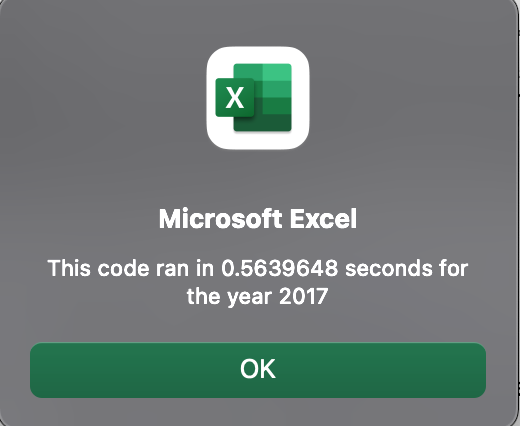

# Module_2_Challenge
## Stock Analysis on 12 stocks
The purpose of this challenge was to first use VBA to determine DAQO's stock price and whether or not it was a good buy
* It turns out that DAQO had a loss of 62.6%, so it was not a good buy
The next part was to see how all 12 stocks did between 2017 & 2018
* The VBA knowledge learned for DAQO was expanded to using VBA for all 12 stocks
* * The performace and return of all 12 stocks were able to be seen visually in the worksheet "All Stocks Analysis"
* * * It was in that worksheet where the buttons were created for ease of use for running VBA code

## Findings
For 2017, the overall 12 stocks did really well

Only TERP did not show a positive ROI
So if anyone had the other 11 in their stock portfolio, they would have seen a positive ROI between 8.9%-199.4%
* Assuming the stocks had some serious cash in them, one could be able to use some of their ROI for more stocks or other things that are pressing
* Even if one had just these 12 stocks, 2017 was a good year for that individual

For 2018, the overall 12 stocks did not fare so well

Not only did just 2 provide a positive ROI, but the losses ranged from -3.5% to - 62.6%
* Only ENPH and RUN showed a positive ROI with 81.9% and 84.0% respectively
* * 2018 was not a good year for anyone who had the other 10 stocks in their portfolio
* * This level of volatility in just 2 years is quite alarming
* * One must hope that it was the economy, otherwise diversifying or removing these stocks from one's portfolio might/would be a smart choice

The refactored code was a slight improvement
Both times it was run for 2017 & 2018, the amount of time went down from .7 to .5

#### Original times

#### Refactored times

### Below is my refactored script
#### (Opted to copy & paste here due to screenshot issues, format is off but unable to fix here)

Sub AllStocksAnalysisRefactored()
    Dim startTime As Single
    Dim endTime  As Single

    yearValue = InputBox("What year would you like to run the analysis on?")

    startTime = Timer
    
    'Format the output sheet on All Stocks Analysis worksheet
    Worksheets("All Stocks Analysis").Activate
    
    Range("A1").Value = "All Stocks (" + yearValue + ")"
    
    'Create a header row
    Cells(3, 1).Value = "Ticker"
    Cells(3, 2).Value = "Total Daily Volume"
    Cells(3, 3).Value = "Return"

    'Initialize array of all tickers
   Dim tickers(11) As String
   tickers(0) = "AY"
   tickers(1) = "CSIQ"
   tickers(2) = "DQ"
   tickers(3) = "ENPH"
   tickers(4) = "FSLR"
   tickers(5) = "HASI"
   tickers(6) = "JKS"
   tickers(7) = "RUN"
   tickers(8) = "SEDG"
   tickers(9) = "SPWR"
   tickers(10) = "TERP"
   tickers(11) = "VSLR"

    
    'Activate data worksheet
    Worksheets(yearValue).Activate
    
    'Get the number of rows to loop over
    RowCount = Cells(Rows.Count, "A").End(xlUp).row
    
    '1a) Create a ticker Index
    'setting tickerIndex to zero to begin the process of looping so we can get the needed data
    tickerIndex = 0

    '1b) Create three output arrays
    'output arrays for ticckerVolumes, tickerendprice, and tickerstartprice and creating the three variables
    Dim tickerVolumes(12) As Long
    Dim tickerstartprice(12) As Single
    Dim tickerendprice(12) As Single
    
    ''2a) Create a for loop to initialize the tickerVolumes to zero.
    'initializing tickerVolumes, tickerendprice, and tickerstartprice at zero to correctly use data
    For i = 0 To 11
        tickerVolumes(i) = 0
        tickerendprice(i) = 0
        tickerstartprice(i) = 0
        
        Next i
        
        
    ''2b) Loop over all the rows in the spreadsheet.
    'looping over every row in thespreadhseet to get the necessary data
    Worksheets(yearValue).Activate
       For j = 2 To RowCount

        '3a) Increase volume for current ticker
        'ensuring the volume isadjusted based of the ticker index to get correct total daily volume
        If Cells(j, 1).Value = tickers(tickerIndex) Then
        tickerVolumes(tickerIndex) = tickerVolumes(tickerIndex) + Cells(j, 8).Value
        
        End If
        
     '3b) Check if the current row is the first row with the selected tickerIndex.
     'Ensuring the first row is the selected tickerIndex, check the row and column
     'getting starting price for current ticker to ensure we have correct numbers for total daily volume & return output
If Cells(j - 1, 1).Value <> tickers(tickerIndex) And Cells(j, 1).Value = tickers(tickerIndex) Then

               tickerstartprice(tickerIndex) = Cells(j, 6).Value
               
        End If
               
  '3c) check if the current row is the last row with the selected ticker
         'If the next row’s ticker doesn’t match, increase the tickerIndex
         'Ensuring the last row is the selected tickerIndex, checkthe row and column
'get ending price for current ticker to ensure we have the correct numbers for total daily volume and return
If Cells(j + 1, 1).Value <> tickers(tickerIndex) And Cells(j, 1).Value = tickers(tickerIndex) Then

               tickerendprice(tickerIndex) = Cells(j, 6).Value
               
        End If

            '3d Increase the tickerIndex.
            'increase tickerIndex to cycle through all 12 tickers
            If Cells(j + 1, 1).Value <> tickers(tickerIndex) Then
             
                tickerIndex = tickerIndex + 1
                
                End If
                
    Next j
    
    '4) Looping through all arrays to output the Ticker, Total Daily Volume, and Return.
    'needed so that we get the entire ticker data for analysis
        
        Worksheets("All Stocks Analysis").Activate

For k = 0 To 11

       Cells(4 + k, 1).Value = tickers(k)
       Cells(4 + k, 2).Value = tickerVolumes(k)
       Cells(4 + k, 3).Value = tickerendprice(k) / tickerstartprice(k) - 1

    'Formatting the background color of the cells to indicate positive or negative stock return
    'Formatting row 3 headers
    Worksheets("All Stocks Analysis").Activate
    Range("A3:C3").Font.FontStyle = "Bold"
    Range("A3:C3").Borders(xlEdgeBottom).LineStyle = xlContinuous
    Range("B4:B15").NumberFormat = "#,##0"
    Range("C4:C15").NumberFormat = "0.0%"
    Columns("B").AutoFit

        
        If Cells(4 + k, 3).Value > 0 Then
            
            Cells(4 + k, 3).Interior.Color = vbGreen
            
        ElseIf Cells(4 + k, 3).Value < 0 Then
        
            Cells(4 + k, 3).Interior.Color = vbRed
            
            Else
            
           Cells(4 + k, 3).Interior.Color = xlNone
            
        End If
        
    Next k
    
    endTime = Timer
    MsgBox "This code ran in " & (endTime - startTime) & " seconds for the year " & (yearValue)
    
End Sub

Sub ClearAll()
'logic above was not working
'hard coded in for my testing
Range("C4:C15").Interior.Color = xlNone
Cells.ClearContents
End Sub

## Further Thoughts
The main advantage of refactoring script is that the first time it is done may not be the cleanest

It always helps to ensure the code is easily readable (or as much as possible)
* When getting audited it helps and when being viewed by someone less technically capable it helps
Plus, refactoring can help reduce the time it takes to get the output needed from VBA, also cutting back on computing power, allowing that power to be utilized   more efficiently & effectively
The main disadavantage of refactoring is that it is going to take more time
* If the first iteration of your script works, then redoing it is just extra work
* * And if it's just you looking at the code then there is much less reason to worry about how it looks
However, not refactoring would mean the output might take longer than preferred, which also means more computing power is being used, taking it away from other   needed functions

For what I did, given that time difference was only by .2, not much changed however, I would say the refactored code could run for longer periods of time
   without glicting the VBA Module or Excel
Refactoring did take some time, and if I had super pressing tasks then it would be less desirable to refactor
* Especially given my first time code already looked clean
* * But it did give me some extra practice with VBA which is good
